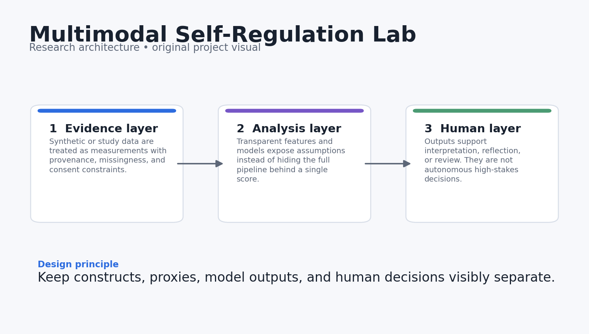
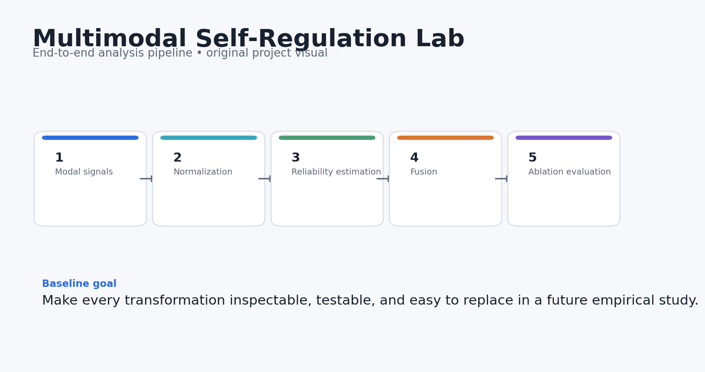
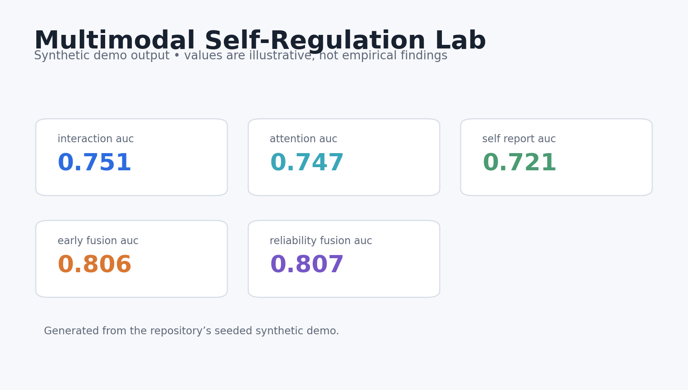
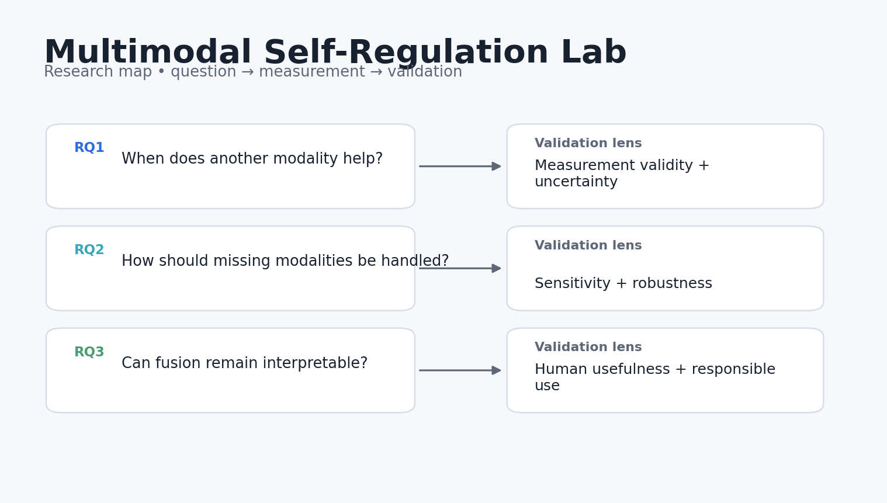

# Multimodal Self-Regulation Lab

**A multimodal feature-fusion sandbox for studying self-regulated learning without hiding modality reliability.**

> Research prototype. All bundled data and results are synthetic demonstrations. Nothing in this repository should be interpreted as evidence about real learners, teachers, or institutions.



## Why this project exists

Multimodal learning analytics often jumps straight from sensor streams to a model score. This repo makes the fusion logic explicit. It simulates interaction, gaze-like attention, and self-report features, tracks missing modalities, and compares early fusion with reliability-weighted fusion.

The engineering goal is simple: make the research logic inspectable. Every metric in the demo can be traced back to a small function, the demo data can be regenerated from a fixed seed, and the limitations are stated next to the claims rather than buried at the end.

## Research questions

1. When does adding another modality improve prediction rather than add noise?
2. How should a system react when one modality is missing or unreliable?
3. Can reliability-weighted fusion remain interpretable enough for learning-science analysis?

## What the repository does



The reference pipeline follows five stages:

1. **Modal signals**
2. **Per-modality normalization**
3. **Reliability estimation**
4. **Fusion**
5. **Ablation evaluation**

The current implementation is deliberately compact enough to audit. It is a foundation for a real study, not a theatrical “AI demo.”

## Core outputs

- `interaction_auc`
- `attention_auc`
- `self_report_auc`
- `early_fusion_auc`
- `reliability_fusion_auc`
- `missing_modality_delta`



The dashboard above is generated from **synthetic data** and is included only to show what the analysis surface looks like. It is not a reported empirical result.

## Quick start

```bash
python -m venv .venv
source .venv/bin/activate  # Windows: .venv\Scripts\activate
pip install -e .[dev]
python examples/demo.py
pytest -q
```

You can also use Docker:

```bash
docker build -t multimodal_self_regulation_lab .
docker run --rm multimodal_self_regulation_lab
```

## Repository structure

```text
multimodal_self_regulation_lab/
├── src/multimodal_self_regulation_lab/        # core implementation and synthetic-data generator
├── examples/demo.py        # end-to-end reproducible demo
├── tests/                  # executable unit tests
├── docs/                   # research design, data dictionary, references
│   └── images/             # original project diagrams and demo visualisations
├── results/                # synthetic demo outputs only
├── config/default.yaml
├── Dockerfile
├── Makefile
└── pyproject.toml
```

## Research design in one picture



The fuller design rationale is in [`docs/research_design.md`](docs/research_design.md), including constructs, assumptions, validation steps, and a proposed empirical extension.

## Reproducibility choices

- Synthetic generation uses a fixed random seed.
- The core metrics are implemented as small, testable functions.
- The demo writes machine-readable results into `results/`.
- CI runs the tests on every push and pull request.
- No API keys, proprietary datasets, or external model calls are required for the baseline.

## Responsible-use boundaries

- Synthetic “attention” variables are not eye-tracking measures and should not be interpreted as such.
- In-sample AUC is used only for a compact demo; real studies require held-out evaluation.
- Multimodal data raise privacy and consent issues that must be addressed before collection.

## Strong next experiments

- Use nested cross-validation and subgroup robustness checks.
- Add explicit sensor-quality models and late-fusion baselines.
- Test whether multimodal feedback is understandable and actionable for learners and educators.

## References

See [`docs/references.md`](docs/references.md). The references are there to locate the project in current AIED, learning-analytics, human-centered AI, and instructional-design research. They do **not** imply endorsement or affiliation.

## Citation

If you build on this research prototype, use the metadata in [`CITATION.cff`](CITATION.cff).

## License

MIT for the code in this repository. Research data from future studies should use a separate data-governance and consent process.
